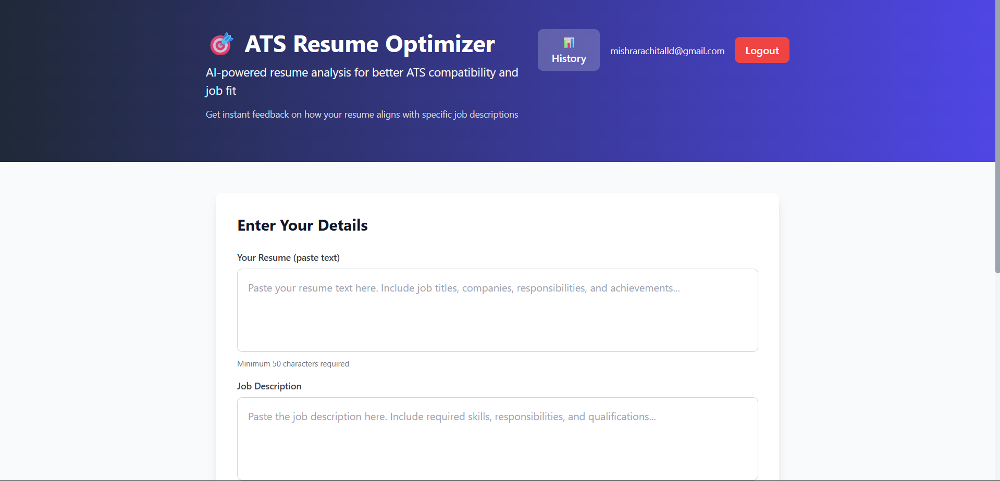

# 🎯 ATS Resume Optimizer

An AI-powered resume analyzer that helps job seekers optimize their resumes for Applicant Tracking Systems.


---

## 🚀 Live Demo

**Deployed URL:** https://resume-checker-silk.vercel.app/
---

## 📝 Technical Write-up

### What AI Model I Used
I integrated **Groq's LLaMA-3.3-70B** model via the Groq API. This is a powerful open-source LLM that excels at text analysis and structured output generation.

### Why I Chose This Model
- **Speed**: Groq offers the fastest inference for LLaMA models (under 1 second responses)
- **Free Tier**: Generous free API quota perfect for MVPs
- **Quality**: 70B parameter model provides accurate, nuanced analysis
- **JSON Output**: Reliable structured JSON responses needed for my scoring system

### How AI is Used in the App
The AI acts as an **ATS system + hiring manager**. When a user submits their resume and a job description:
1. The prompt instructs the AI to analyze keyword matches, skill gaps, and experience relevance
2. It returns a structured JSON with: ATS score (0-100), strengths, missing keywords, improvement suggestions, and rewritten bullet points
3. The AI is constrained to **never hallucinate** — it only references actual resume content

### Architecture
```
┌─────────────┐     ┌────────────────┐     ┌─────────────┐
│   Next.js   │────▶│   API Routes   │────▶│   Groq AI   │
│   Frontend  │     │  (Node.js)     │     │  LLaMA-3.3  │
└─────────────┘     └────────────────┘     └─────────────┘
       │                    │
       │                    ▼
       │            ┌────────────────┐
       └───────────▶│   Supabase     │
                    │   (Postgres)   │
                    └────────────────┘
```

---

## ✨ Features

| Feature | Description |
|---------|-------------|
| 📊 **ATS Score** | Get a 0-100 compatibility score with animated progress bar |
| 🔍 **Gap Analysis** | See exactly which keywords from the job description are missing |
| 💪 **Strengths Detection** | Identify what's already working well in your resume |
| ✏️ **Smart Rewrites** | AI-optimized bullet points that preserve your facts but improve ATS matching |
| 📜 **History** | All past analyses saved to your account |
| 🔐 **Authentication** | Secure login with JWT tokens |

---

## 🛠️ Tech Stack

- **Frontend**: Next.js 15, React 18, TypeScript, Tailwind CSS
- **Backend**: Next.js API Routes (serverless)
- **Database**: Supabase (PostgreSQL)
- **AI**: Groq API with LLaMA-3.3-70B
- **Auth**: Custom JWT authentication with bcrypt password hashing

---

## 📂 Project Structure

```
resume-checker/
├── app/
│   ├── api/
│   │   ├── analyze/route.ts      # Resume analysis endpoint
│   │   ├── analyses/route.ts     # Past analyses CRUD
│   │   └── auth/                 # Login, register, logout, session
│   ├── auth/
│   │   ├── login/page.tsx        # Login page
│   │   └── signup/page.tsx       # Registration page
│   ├── components/
│   │   ├── analysis-form.tsx     # Resume & JD input form
│   │   ├── analysis-results.tsx  # Results display
│   │   ├── ats-score.tsx         # Animated score circle
│   │   ├── optimized-bullets.tsx # Before/after comparisons
│   │   └── past-analyses.tsx     # History modal
│   └── page.tsx                  # Main dashboard
├── lib/
│   ├── ai-service.ts             # Groq API integration
│   ├── auth.ts                   # JWT & password utilities
│   ├── prompt-engineering.ts     # AI prompts (anti-hallucination)
│   └── supabase.ts               # Database operations
└── middleware.ts                 # Route protection

---

## 🚀 Getting Started

### Prerequisites
- Node.js 18+
- npm or yarn
- Supabase account (free tier works)
- Groq API key (free at [console.groq.com](https://console.groq.com))

### 1. Clone & Install

```bash
git clone https://github.com/your-username/resume-checker.git
cd resume-checker
npm install
```

### 2. Set Up Environment Variables

Create a `.env` file in the root directory:

```env
# Groq AI
GROQ_API_KEY=your_groq_api_key_here

# Supabase
NEXT_PUBLIC_SUPABASE_URL=your_supabase_url
NEXT_PUBLIC_SUPABASE_ANON_KEY=your_supabase_anon_key

# JWT Secret (change this!)
JWT_SECRET=your-super-secret-jwt-key-min-32-chars
```

### 3. Set Up Database

Run the SQL schema in your Supabase SQL Editor:


### 4. Run Development Server

Open [http://localhost:3000](http://localhost:3000) — you'll be redirected to login.

---

## 🔒 How Authentication Works

1. **Registration**: Email + password → password hashed with bcrypt → stored in `users` table
2. **Login**: Verify password → generate JWT token → set as HTTP-only cookie
3. **Protected Routes**: Middleware checks JWT on every request
4. **Session**: Token valid for 7 days

---

## 🤖 How the AI Analysis Works

### Prompt Engineering
The AI is given strict rules to prevent hallucination:
- ✅ Only use information explicitly stated in the resume
- ✅ Identify real gaps between resume and JD
- ✅ Optimize wording, not content
- ❌ Never suggest adding fake experiences

### Response Validation
Every AI response is validated:
- Must be valid JSON
- Must have all required fields
- ATS score must be 0-100
- All arrays must be properly formed

---

## 📸 Screenshots



## 👤 Author

**Rachit Mishra**
- GitHub: [rachit0203](https://github.com/rachit0203)
- Email: [mishrarachitalld@gmail.com]

---

*Built with ❤️ for the AI Builder Intern assignment*
